# Coffee-Sales-Dashboard-Using-Excel
This Project is inspired by Mo Chen’s Coffee Sales Dashboard.
## Data Set:
Name: Coffee Orders Data
This Excel workbook, contains three datasets, Orders, Customers and Products. 

# Data Gathering
Let’s first see the Orders data.
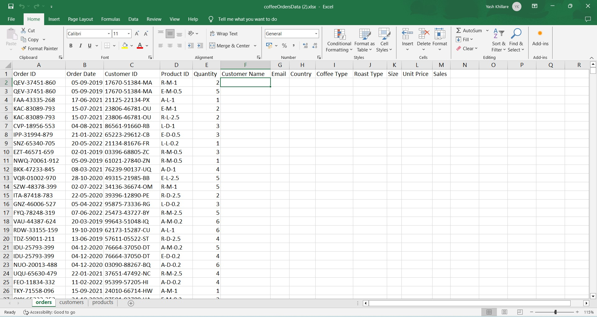

## Customer Sheet
We must populate the Customer Name, Email and Country columns of the Order’s data from the Customer’s data. Then Coffee Type, Roast Type, Size, Unit Price and Sales columns from the Product’s data. 
We will use **VLOOKUP** to extract the customer’s name data from the Customer’s data.

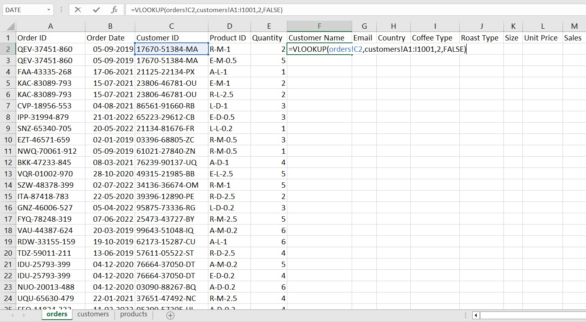

We will use **VLOOKUP** once again to populate the email column. 

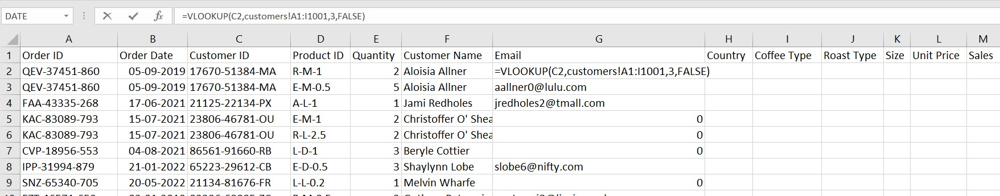

We can see that the Email column contains the value “0”, for the missing values. To solve this problem, we use the “**IF**” statement. 

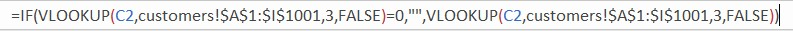

The Email column looks a bit nicer now.

We will again use the “**VLOOKUP**” formula but with the “**Match**” function. Instead of counting columns in the Customer’s data to find the country column we can use the “**Match**” function to get the position of our desired column. 

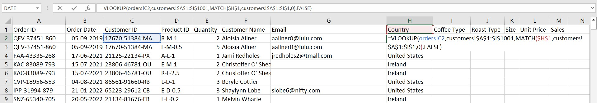

We also need the “Loyalty Card” column from the Customer’s sheet for that we will use the “**VLOOKUP**” formula.

## Product Sheet

Now, we can still use the “**VLOOKUP**” formula to extract data from the Product sheet but there is a more convenient way of doing this. We will use “INDEX-MATCH” instead of “**VLOOKUP**”.

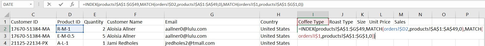

The “INDEX” function takes three basic arguments, array, row number and column number. Our array for extracting the “Coffee Type” is the Product sheet, for row number and column number we will use the “Match” function. But remember for the row we are fixing the “Product ID” column or the “D” cell by using absolute reference for the “D2” cell ($D2) so that when we drag this formula horizontally it will not change the “D” cell because it acts like a primary key in the Product sheet.
 
For the column, we are fixing the first row containing the “Coffee Type” by using absolute reference for the “I1” cell (I$1) so that when we drag the formula down it will not change the row. 
After finishing the formula hit enter and then just drag the formula towards the Unit Price column, autofill the cell to populate the above rows. 

For Sales 
We will multiply the “Quantity” column with the “Unit Price” column.

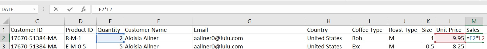

With that, we have successfully gathered all the data we need.
# Data Cleaning
## Date formatting
Select the whole “Order Date” and press “Ctrl” + 1 to open the format cell toolbox, then to the Number section, under the category section select the “Custom” option.

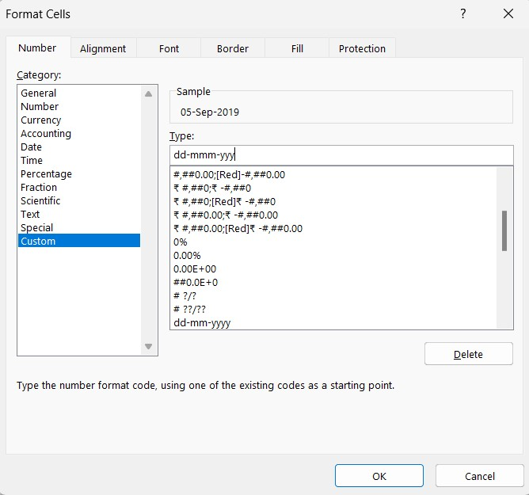

Sales and Unit Price columns:
Convert the values in these columns to currency format.

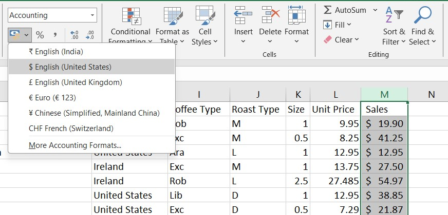
<b></b>
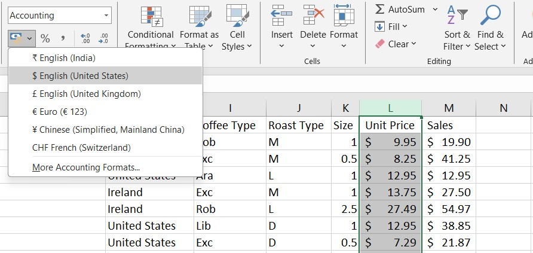

Create a “Coffee Type Name” to store the full name of the coffee type. We will use "**IFS**" statement here.

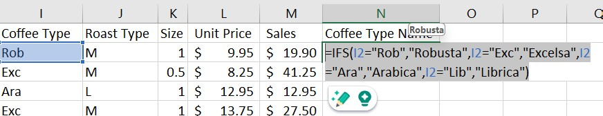

Size Column
The values in this column only contain value but we want it to show the unit “kg” also. Therefore, open the format cells toolbox after selecting the “Size” column. Click on the Number section, and in the category option select “Custom”.

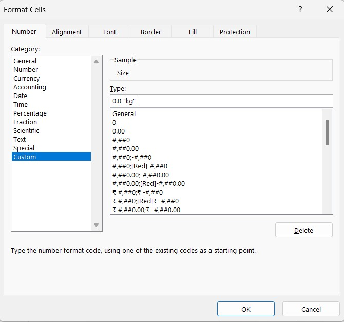

After cleaning the Orders Data, press “Ctrl” + t, to convert the Orders sheet into a table. By converting it into a table, the data will automatically get updated if new data is added.

# Pivot Tables
1.	Total Sales Over Time 

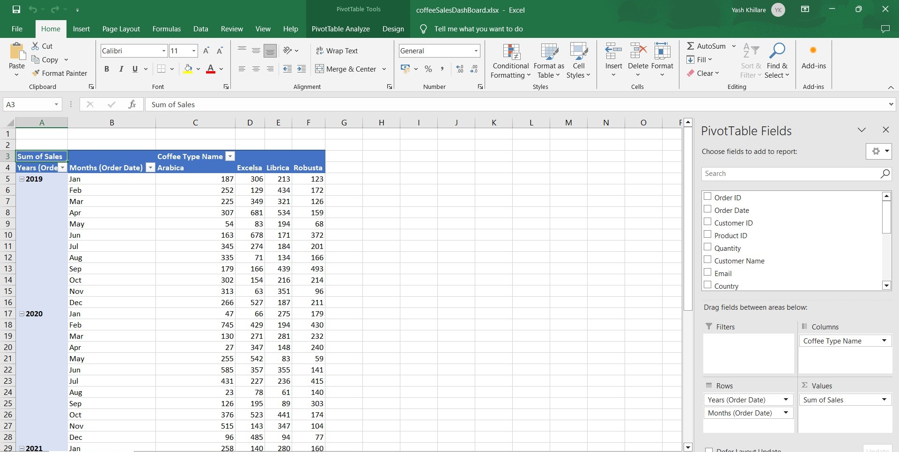

To calculate total sales, select the “Years”, and the “Months” columns as the rows, “Coffee Type Name” as the column and “Sum of Sales” as the values.

Select the entire table and click on the “PivotTable Analyze” Ribbon, select Pivot Chart under the tools section to create a chart. I have made some custom changes to my chart. You can customize, your charts as per your wish.  

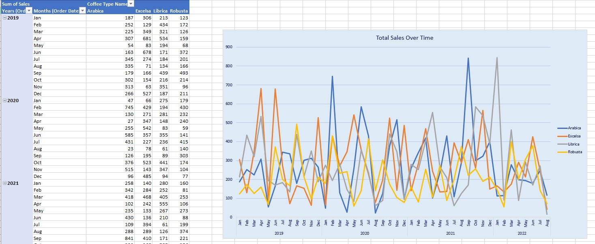

2.	Total Sales vs Country

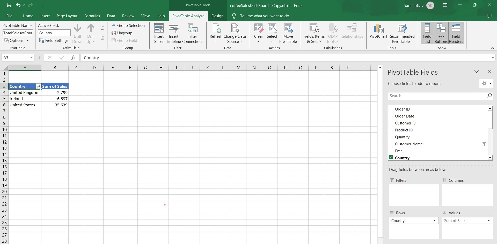

The “Country” column is selected as rows and “Sum of Sales” is selected as columns.

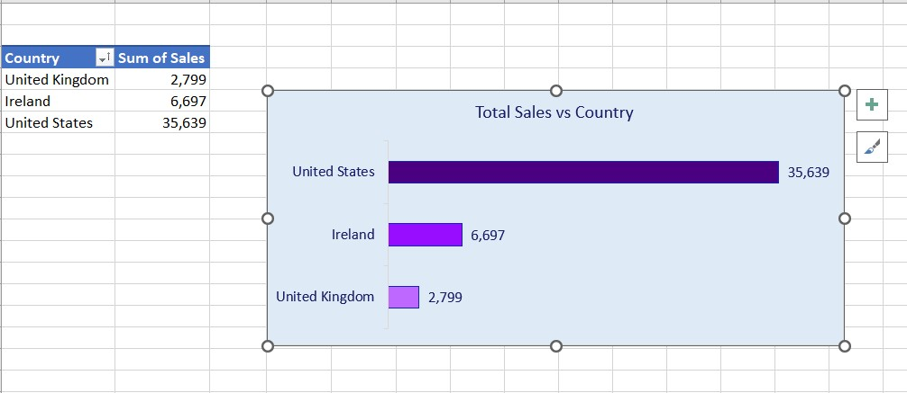

3.	Top 5 Customers

Similarly, create a bar chart for top 5 customers.

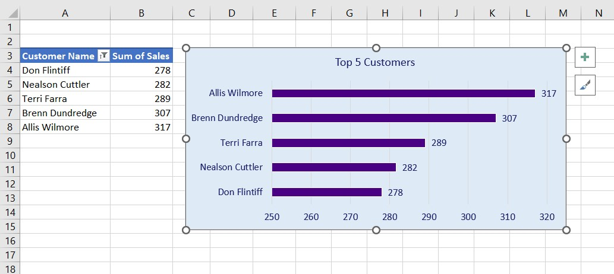

4.	Coffee Type Popularity Share

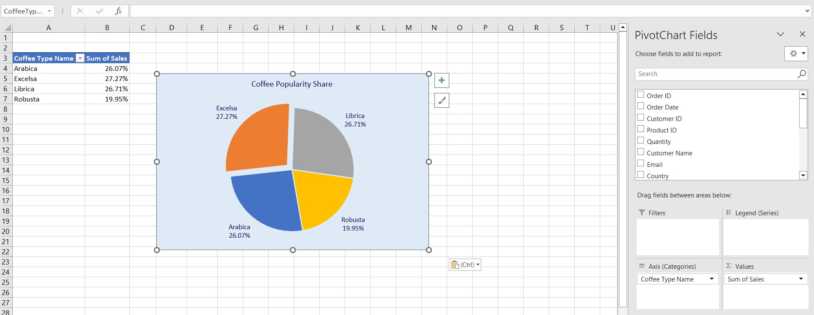

# Dashboard

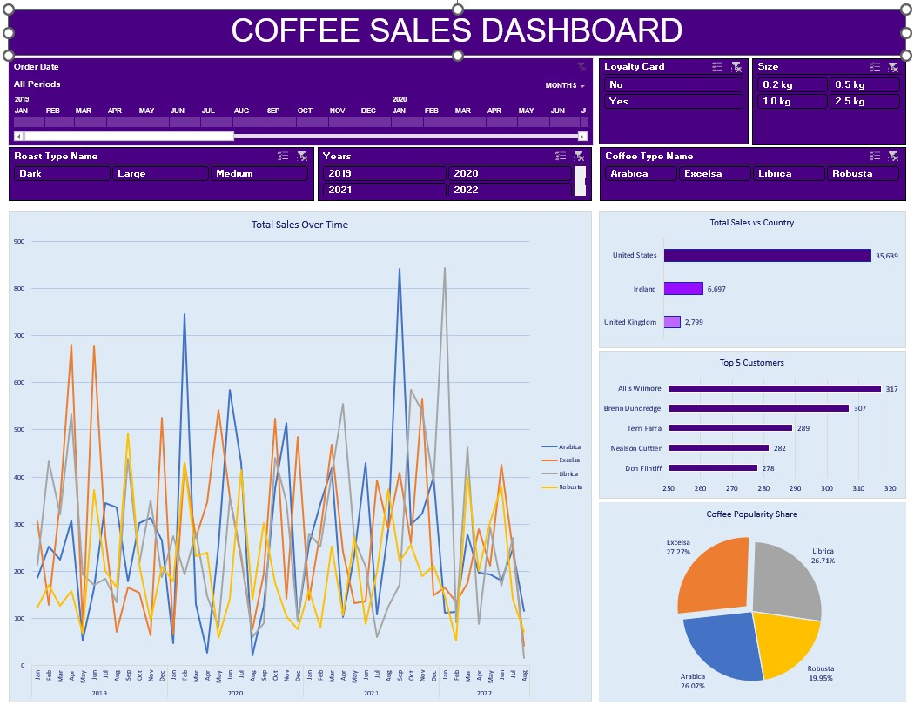